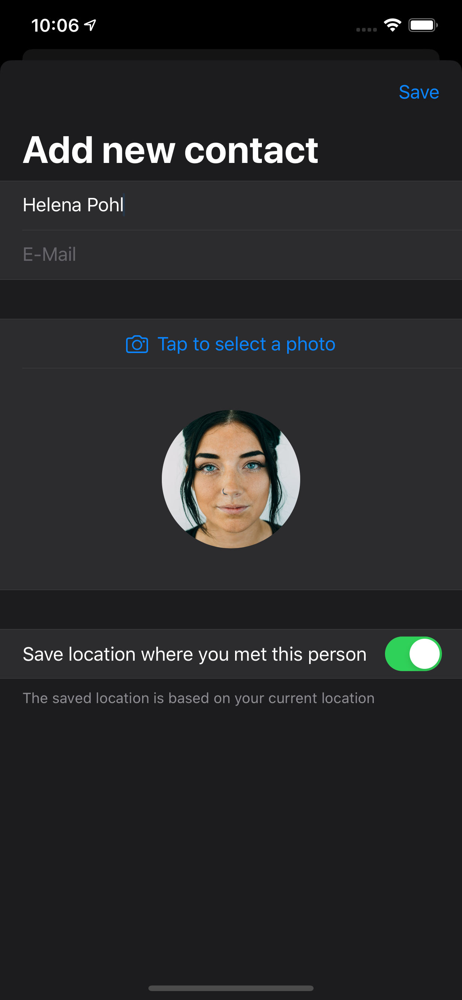

# Remember Me

Have you ever been to a conference or a meetup, chatted to someone new, then realized seconds after you walk away that you’ve already forgotten their name?

The goal for this project was to solve this problem with an app which lets you import an image from the user's photo libary and attach a name to it.
All persons are shown in a List and by tapping one person you see a detail view with more information about the person.

On day 78 the app was extended so you can take pictures with the camera and save the location where you met the person. 

Known bugs: pictures dont show correctly on main screen

 

